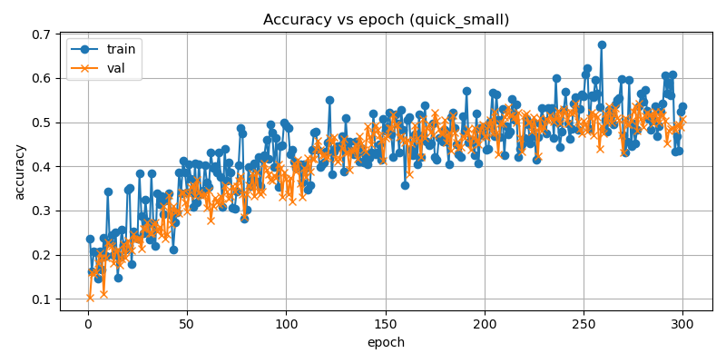
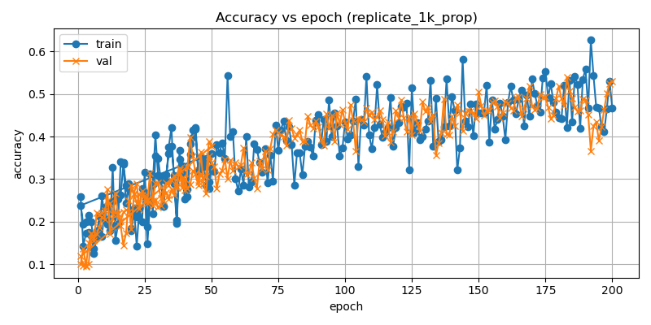

# FedFold

## How to run

Use `train_fedfold.sh`.

`quant_bits` is set to `-1` for random quantization level.

## Configuration

1. Change to different size of ResNet:

In `model.py` , ResNet class, change `num_blocks = [.,.,.,.]`

```bash
ResNet18 -> [2,2,2,2]
ResNet152 -> [3,8,36,3]
```

2. Change to different models:

In `data.py`, `set_parameters` function, change `model_fn` in the dataset that yo train.


## Evaluate Large Scale

* branch: `feat/scale-replicate`

* `FedFold/scripts/run_scale_experiments.sh`
    edit the script or export before running:
    ```
    export GPUS=(1)
    export RUN_MODE=sequential
    ./scripts/run_scale_experiments.sh
    ```

### Summary
To measure the performance of the system/communication/computing power at a large scale, we add a replicate mode to reuse base splits, saving memory and startup time.

- Added `sim_mode=replicate` to simulate a large number of clients under resource constraints (example: `n_device`: 100 -> 10000).
    - `sim_mode=replicate` creates K base splits (`--replicate_splits K`) and reuses them to map to `n_device` virtual clients each epoch. This saves memory and startup time because only K index lists are stored instead of one per virtual client.
    - By default the mapping from virtual client index -> base split is randomized each epoch. That means a given virtual client ID may see different local data across epochs when using `replicate`. If you need stable per-client local data for personalization or long-term client analysis, use `sim_mode=none` (which creates one split per client) or modify the mapping to be persistent.

- Added `selection_mode` to control how clients are selected each round. Two modes are supported:
    - `fixed` — select a fixed number of clients each round (use `--selected_device N`).
        Use this when you want to keep the absolute per-round workload constant across experiments (original setting)
    - `proportional` — select a fraction of the population each round (use `--participation_rate p`, selected ≈ `round(n_device * p)`).
        Use this when you want the participation fraction to remain comparable as `n_device` scales (helpful for scale-performance studies).

Example (quick smoke run):
```
python train.py --n_device 10000 --sim_mode replicate --replicate_splits 100 \
        --selection_mode proportional --participation_rate 0.01 --global_epochs 2 --local_epochs 1 --n_split 2 --dataset CIFAR10
```

### Example results

Below are example training accuracy curves produced from recent runs (PNG files are under `run_logs/plots/`).

- Quick small run (`quick_small`): shows training and validation accuracy vs epoch for a smaller-scale smoke test.

    

- Replicate proportional selection (`replicate_1k_prop`): shows training and validation accuracy vs epoch for a replicated-splits experiment with proportional selection.

    